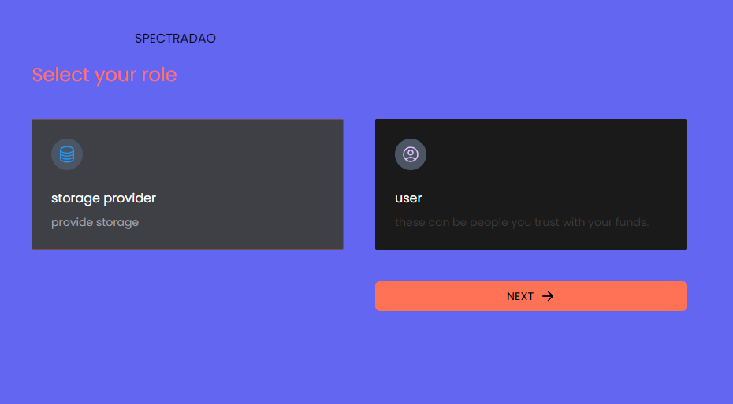
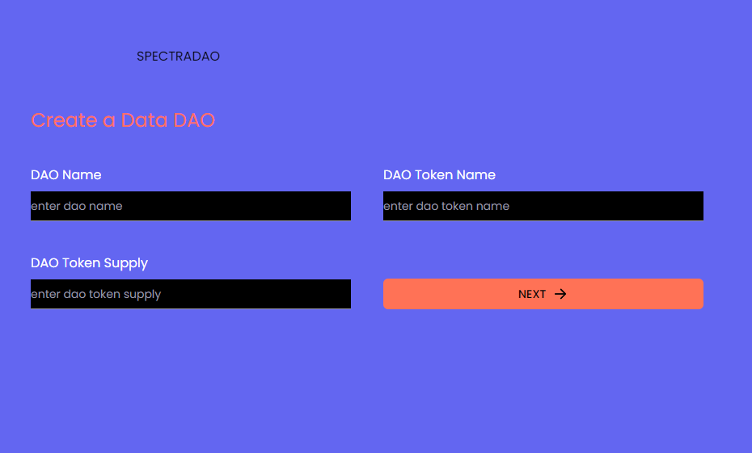
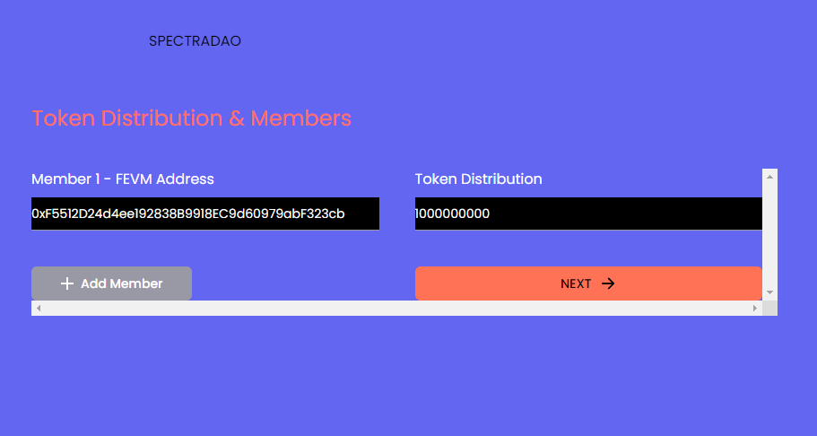
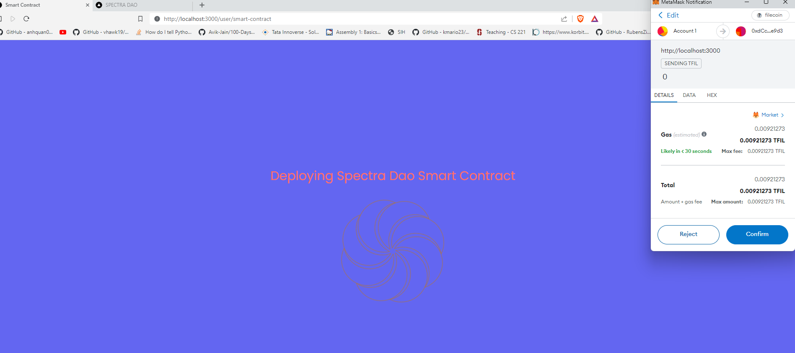
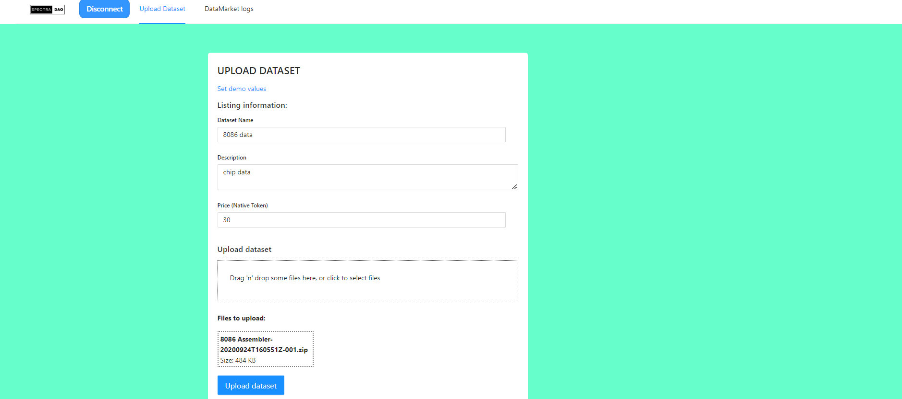
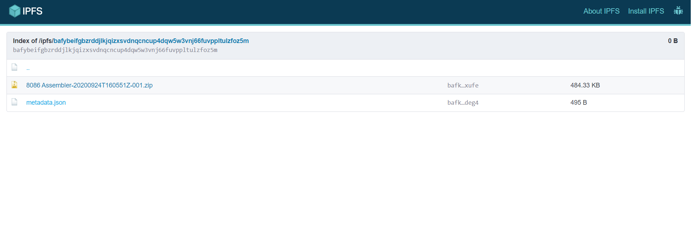

# SPECTRA DAO

Spectra DAO is a platform for data DAOs and a data marketplace, requiring no coding.

## Spectra DAO

Spectra DAO streamlines the process, making it more accessible for DAOs to establish their own DataDAO on FVM. This empowers DAOs to incentivize Storage Providers for secure file storage through native governance tokens on FEVM.

## Spectra Markets

Spectra Markets revolutionizes the landscape, providing a dynamic platform where anyone can effortlessly craft and manage data purchase or checkout pages on the cutting-edge FEVM network.

## Motivation

In the current landscape, the majority of datasets are predominantly in English, leading to potential biases in models. This situation calls for change, as everyone deserves an equal opportunity in the realm of AI. Spectra DAO addresses this gap by enabling diverse language communities to establish their own DAOs and monetize their data based on their unique needs for monetization. With Spectra DAO, individuals with zero coding knowledge can seamlessly deploy their DAO, issue tokens, and incentivize users to utilize any storage provider.

Moreover, we are not only reliant on language datasets, but we also invite anyone to create and sell datasets of various kinds in our marketplace. This inclusive approach opens up a world of possibilities for data diversity and innovation.

# Documentation

Spectra DAO provides a user-friendly interface that simplifies the creation of DAOs, eliminating the need for advanced coding skills. This means that individuals who may not have a technical background can still participate in the decentralized data marketplace. By utilizing Spectra DAO, users can efficiently monetize their data, opening up new opportunities for revenue generation and economic empowerment.

Step 1: **Users can effortlessly create a DAO through the user-friendly interface.**

The user should select an option based on their requirements and then proceed by clicking 'Next'.

Step 2: **The user is required to input DAO details.**

Step 3: **The user is required to input the mint address for the token and the distribution amount.**

Step 4: **The final step involves deploying the DAO contracts to the FEVM chain**

## Spectra Markets

**user can easily upload data to storage using spectradao interface. contract will be depoyed to fevm and file to ipfs**

